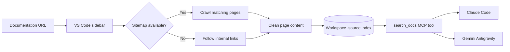

# Source

Documentation retrieval for coding agents, directly from VS Code.

[](https://code.visualstudio.com/)
[](https://www.typescriptlang.org/)
[](LICENSE.md)

Source crawls a documentation site, stores the useful content in your workspace, and exposes it through a `search_docs` MCP tool. Coding agents can search the actual documentation for a project instead of answering from memory or stale training data.

The index stays local to the workspace. There is no hosted search service or account to configure.


## Why Source

- **Current answers:** agents search the documentation URL you chose.
- **Focused results:** BM25-style full-text search returns the five most relevant pages, with titles, excerpts, scores, and source URLs.
- **Local state:** crawled pages and source metadata live under `.source/` in the current workspace.
- **Automatic setup:** Source creates the MCP and instruction files needed by supported agents.
- **Multiple sources:** documentation from several sites can be searched through one MCP tool.

## How it works



Source first looks for a nearby sitemap, a sitemap declared in `robots.txt`, or a root sitemap. If none yields matching pages, it follows same-host links recursively. Navigation, headers, footers, scripts, and styles are removed before the remaining text is indexed.

When an agent calls `search_docs`, Source searches page titles and content, gives titles extra weight, and supports prefix and fuzzy matching. The MCP server returns up to five results and includes the original documentation URL with each one.

## Quick start

### Requirements

- VS Code 1.107 or newer
- Node.js 20.18.1 or newer and npm
- Claude Code or Gemini Antigravity to consume the generated MCP configuration

### Run from source

```bash
git clone https://github.com/srirsatt/Source.git
cd Source
npm ci
npm run compile
code .
```

Press `F5` in VS Code to open an Extension Development Host with Source loaded.

### Index documentation

1. Open the project where the agent will use the documentation.
2. Select **Source** in the VS Code activity bar.
3. Paste a documentation URL, such as `https://docs.example.com/getting-started`.
4. Press Enter or select the add button.
5. Wait for the source to appear in the indexed sources list.
6. Restart or reload the agent if it was already running so it picks up the new MCP configuration.

Add more URLs the same way. To remove one, hover over it in the Source sidebar and select the remove button.

## Supported agents

| Agent | MCP configuration | Instructions |
| --- | --- | --- |
| Claude Code | `.mcp.json` | `CLAUDE.md` and `.source/claude-<host>.md` |
| Gemini Antigravity | `~/.gemini/antigravity/mcp_config.json` | `.agent/rules/source-general.md` and `.agent/rules/source-<host>.md` |

Both integrations register the server as `source-docs` and tell the agent to use `search_docs` before answering questions about indexed libraries.

## Files Source creates

| Path | Purpose |
| --- | --- |
| `.source/manifest.json` | Tracks indexed hosts, page counts, and timestamps |
| `.source/pages-<host>.json` | Stores cleaned page content for one source |
| `.source/claude-<host>.md` | Gives Claude Code a summary and topic list for that source |
| `.agent/rules/source-<host>.md` | Gives Antigravity source-specific instructions and topics |
| `.agent/rules/source-general.md` | Lists all indexed sources and the shared search policy |
| `.mcp.json` | Registers `source-docs` for Claude Code |
| `CLAUDE.md` | Loads Source's documentation instructions for Claude Code |
| `~/.gemini/antigravity/mcp_config.json` | Registers `source-docs` for Antigravity |

Source preserves other MCP server entries when it updates an existing JSON configuration. It currently generates `CLAUDE.md` itself, so review that file before using Source in a repository that already maintains its own Claude instructions.

The generated index is project data. Add `.source/` to `.gitignore` if you do not want crawled documentation committed to the repository. The agent instruction and MCP files can be committed when you want the setup shared with collaborators, but generated configuration may contain machine-specific extension paths.

## Search tool

Agents call the MCP tool with a plain-language query:

```text
search_docs({ query: "authentication middleware" })
```

The search runs across every source in the workspace. A result contains the page title, documentation URL, relevance score, and a content excerpt. If nothing matches, the tool returns `No results found.`

## Current crawler limits

- Crawls at most 300 pages per request.
- Falls back to internal-link traversal with a maximum depth of three.
- Reads server-rendered HTML; documentation that requires client-side JavaScript may produce incomplete content.
- Does not authenticate to private documentation sites.
- Tracks one source entry per hostname. Adding another URL from the same host updates that entry.
- Runs page requests sequentially, so large documentation sites can take some time to index.

## Development

```bash
npm ci             # install exact dependencies
npm run compile    # build TypeScript into out/
npm run watch      # rebuild on changes
npm run lint       # run ESLint against src/
npm test           # compile, lint, and run extension tests
```

### Project layout

```text
src/
├── extension.ts       VS Code activation and sidebar provider
├── crawler.ts         Sitemap discovery and recursive crawler
├── mcpServer.ts       Local search index and MCP server
├── ruleWriter.ts      Agent rules and MCP configuration
└── test/
    └── extension.test.ts
media/
├── main.js            Sidebar client logic
├── icon.svg
└── sourcedemo.gif
```

The extension compiles to `out/`, and the MCP server communicates with agents over standard input and output.

## License

Source is available under the [MIT License](LICENSE.md).
